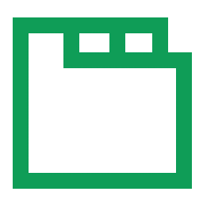

<div align="center">
  
  <h2>Google Sheets Tabs on top</h2>
  <p>
    <b>A browser extension that moves Google Sheets tabs from bottom to top for better usability</b>
  </p>
</div>


[](https://chrome.google.com/webstore/detail/google-sheets-tabs-on-top/lbhlhhckfpdpafckdiklcbamkmogjdjc)   [](https://addons.mozilla.org/ja/firefox/addon/google-sheets-tabs-on-top/)   [](https://chrome.google.com/webstore/detail/google-sheets-tabs-on-top/lbhlhhckfpdpafckdiklcbamkmogjdjc)   [](https://addons.mozilla.org/ja/firefox/addon/google-sheets-tabs-on-top/)   [![DeepWiki](https://img.shields.io/badge/DeepWiki-yamadashy%2Fgoogle--sheets--tabs--on--top-blue.svg?logo=data:image/png;base64,iVBORw0KGgoAAAANSUhEUgAAACwAAAAyCAYAAAAnWDnqAAAAAXNSR0IArs4c6QAAA05JREFUaEPtmUtyEzEQhtWTQyQLHNak2AB7ZnyXZMEjXMGeK/AIi+QuHrMnbChYY7MIh8g01fJoopFb0uhhEqqcbWTp06/uv1saEDv4O3n3dV60RfP947Mm9/SQc0ICFQgzfc4CYZoTPAswgSJCCUJUnAAoRHOAUOcATwbmVLWdGoH//PB8mnKqScAhsD0kYP3j/Yt5LPQe2KvcXmGvRHcDnpxfL2zOYJ1mFwrryWTz0advv1Ut4CJgf5uhDuDj5eUcAUoahrdY/56ebRWeraTjMt/00Sh3UDtjgHtQNHwcRGOC98BJEAEymycmYcWwOprTgcB6VZ5JK5TAJ+fXGLBm3FDAmn6oPPjR4rKCAoJCal2eAiQp2x0vxTPB3ALO2CRkwmDy5WohzBDwSEFKRwPbknEggCPB/imwrycgxX2NzoMCHhPkDwqYMr9tRcP5qNrMZHkVnOjRMWwLCcr8ohBVb1OMjxLwGCvjTikrsBOiA6fNyCrm8V1rP93iVPpwaE+gO0SsWmPiXB+jikdf6SizrT5qKasx5j8ABbHpFTx+vFXp9EnYQmLx02h1QTTrl6eDqxLnGjporxl3NL3agEvXdT0WmEost648sQOYAeJS9Q7bfUVoMGnjo4AZdUMQku50McDcMWcBPvr0SzbTAFDfvJqwLzgxwATnCgnp4wDl6Aa+Ax283gghmj+vj7feE2KBBRMW3FzOpLOADl0Isb5587h/U4gGvkt5v60Z1VLG8BhYjbzRwyQZemwAd6cCR5/XFWLYZRIMpX39AR0tjaGGiGzLVyhse5C9RKC6ai42ppWPKiBagOvaYk8lO7DajerabOZP46Lby5wKjw1HCRx7p9sVMOWGzb/vA1hwiWc6jm3MvQDTogQkiqIhJV0nBQBTU+3okKCFDy9WwferkHjtxib7t3xIUQtHxnIwtx4mpg26/HfwVNVDb4oI9RHmx5WGelRVlrtiw43zboCLaxv46AZeB3IlTkwouebTr1y2NjSpHz68WNFjHvupy3q8TFn3Hos2IAk4Ju5dCo8B3wP7VPr/FGaKiG+T+v+TQqIrOqMTL1VdWV1DdmcbO8KXBz6esmYWYKPwDL5b5FA1a0hwapHiom0r/cKaoqr+27/XcrS5UwSMbQAAAABJRU5ErkJggg==)](https://deepwiki.com/yamadashy/google-sheets-tabs-on-top)


## 🚀 Install

- Chrome: [Google Sheets Tabs on top - Chrome Web Store](https://chrome.google.com/webstore/detail/sheets-tabs-on-top/lbhlhhckfpdpafckdiklcbamkmogjdjc)
- Firefox: [Google Sheets Tabs on top – Firefox Add-ons](https://addons.mozilla.org/firefox/addon/google-sheets-tabs-on-top/)
- Opera: [Google Sheets Tabs on top extension - Opera add-ons](https://addons.opera.com/extensions/details/google-sheets-tabs-on-top/)
- Edge: [Google Sheets Tabs on top – Microsoft Edge Addons](https://microsoftedge.microsoft.com/addons/detail/ecnahjcplfdahhoemcapljecnappncpm)
- Safari: Coming soon

## 🛠️ Features

- Moves Google Sheets tabs from bottom to top of the interface
- Works in both editable and preview modes
- Improves usability by placing tabs in a more intuitive location
- Supports multiple browsers: Chrome, Firefox, Opera, Edge, and Safari
- Lightweight with minimal performance impact

## 🔒 Privacy

Google Sheets Tabs on top does not collect any user data. The extension operates entirely client-side and does not transmit any information to external servers.

## 💻 Development

- Node.js >= v24.0.1

### Setup

```sh
git clone https://github.com/yamadashy/google-sheets-tabs-on-top.git
cd google-sheets-tabs-on-top
npm install
```

### Watch and build

```sh
npm run dev chrome
npm run dev firefox
npm run dev opera
npm run dev edge
npm run dev safari
```

### Build extension

```sh
npm run build chrome
npm run build firefox
npm run build opera
npm run build edge
npm run build safari
```

### Lint codes

```sh
# eslint, tsc --noEmit
npm run lint
```

### Show supported browsers

```sh
npm run supported-browsers
```

## 📜 License

This project is licensed under the [MIT License](LICENSE).
